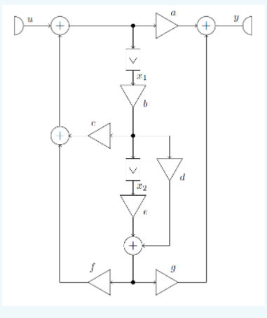

# RendszerelmeletHFseged

Ez egy a BME rendszerelmélet (3. féléves) tárgyához készült program.  
Jelenleg csak az 1. házi feladatból tud megoldani párat.

A fejlesztéshez az Intelli IDEA ide-t használtam. Ebben tudod módosítani, fordítani és futtatni is a projektet.  
(Ha hasznos módosítást hajtasz végre a programon kérlek töltsd fel ide! (push request))

# 9. és 10. feladat ábra
